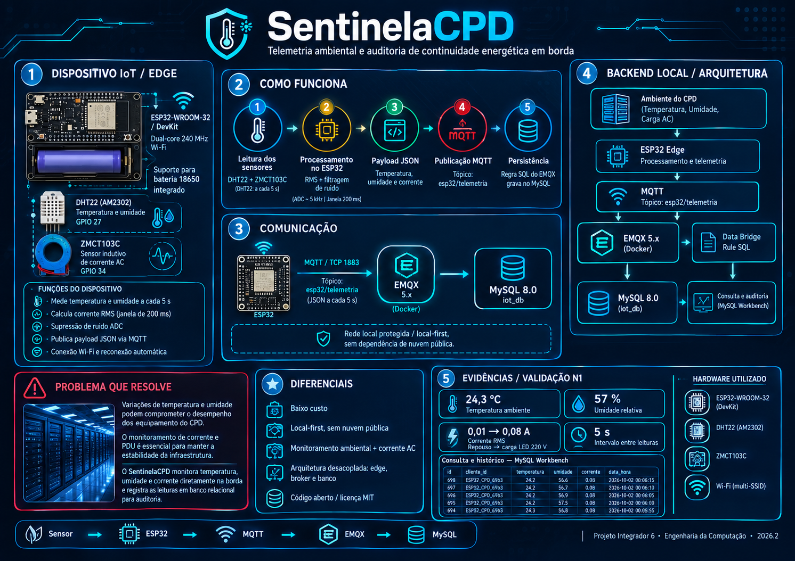
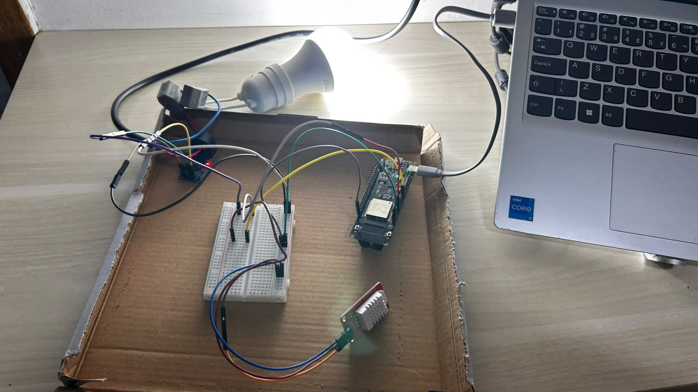
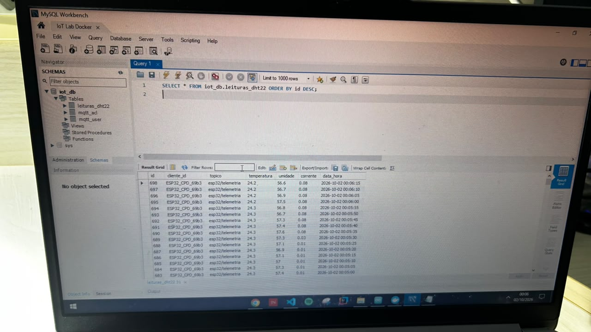

# SentinelaCPD: Telemetria Ambiental e Auditoria de Continuidade Energética em Borda

> **"A estabilidade do CPD não depende da sorte; depende da telemetria contínua na borda."**

> *Plataforma aberta de engenharia que investiga como Sistemas Embarcados, Computação de Borda e Mensageria Assíncrona podem reduzir falhas operacionais, estrangulamento térmico e interrupções de energia em Centros de Processamento de Dados.*




**🔗 GitPage:** `https://<seu-usuario>.github.io/SentinelaCPD/`

---

## 📌 Status do Projeto: Entrega N1 (v1)

O SentinelaCPD concluiu sua **primeira etapa de validação física e arquitetural (N1)** no Projeto Integrador 6 (Engenharia da Computação, 2026.2).

Nesta etapa, a plataforma coleta temperatura e umidade e calcula a corrente alternada eficaz ($I_{\text{RMS}}$) em um circuito de 220 V AC. Os dados seguem de um nó ESP32 até um broker MQTT (EMQX) em Docker e são gravados em um banco MySQL, onde podem ser consultados para auditoria.

A N1 é **uma parte do projeto**. Itens como alimentação por bateria, dashboard e alertas estão no [roadmap](#-roadmap-rumo-à-n2).

---

## 📑 Sumário

1. [Por que o SentinelaCPD?](#por-que-o-sentinelacpd)
2. [Motivação de engenharia](#motivação-de-engenharia)
3. [Stack tecnológica](#-stack-tecnológica)
4. [Visão do sistema e arquitetura](#visão-do-sistema-e-arquitetura)
5. [Fundamentação matemática: RMS](#fundamentação-matemática-cálculo-discreto-de-rms)
6. [Hardware e pinagem](#hardware-e-pinagem)
7. [Resultados experimentais (N1)](#resultados-experimentais-n1)
8. [Limitações conhecidas](#limitações-conhecidas)
9. [Princípios de engenharia](#princípios-de-engenharia-adotados)
10. [Organização do repositório](#organização-do-repositório)
11. [Como reproduzir](#como-reproduzir-o-projeto)
12. [Roadmap](#-roadmap-rumo-à-n2)
13. [Licença](#licença-e-agradecimentos)

---

## Por que o SentinelaCPD?

Servidores e equipamentos de rede raramente avisam quando vão falhar.

Tradicionalmente, a infraestrutura física de TI opera em silos: o ar-condicionado tem seu termostato, os nobreaks (UPS) têm interfaces proprietárias e os técnicos só olham as telas depois do incidente (*downtime*).

Quando a climatização falha de madrugada ou uma tomada de distribuição (PDU) sofre sobrecorrente, a inércia térmica de um rack é curta. Em poucos minutos pode ocorrer *thermal throttling*, degradação de componentes ou desligamento abrupto de servidores.

O SentinelaCPD parte de uma pergunta:

> **Como transformar o ambiente do CPD em um sistema sensorial capaz de auditar continuamente variáveis térmicas e a presença/consumo de energia diretamente na borda?**

A resposta proposta é uma arquitetura de baixo custo, orientada a eventos e *local-first*, em vez de soluções industriais fechadas e caras.

---

## Motivação de engenharia

Ambientes de missão crítica seguem referências como as da **ASHRAE (TC 9.9)**, que recomenda temperatura de bulbo seco entre $18^\circ\text{C}$ e $27^\circ\text{C}$ para CPDs. Para umidade, as edições atuais usam ponto de orvalho; neste projeto adotamos $40\%$ a $60\%$ de umidade relativa como faixa prática de referência.

Três pilares sustentam o trabalho:

1. **Prevenção de hotspots térmicos:** mapear o microclima próximo aos racks antes que o calor residual atinja níveis destrutivos.
2. **Auditoria de carga e continuidade elétrica:** detectar a presença ou o corte de alimentação em circuitos-chave com sensoriamento indutivo não invasivo.
3. **Soberania e desacoplamento:** manter o pipeline de telemetria funcionando em rede local restrita, sem depender de nuvens públicas.

---

## 🧰 Stack tecnológica

| Camada | Tecnologia | Papel no projeto |
| --- | --- | --- |
| **Hardware** | ESP32-WROOM-32 (placa com suporte 18650), DHT22 (AM2302), ZMCT103C | Microcontrolador dual-core com Wi-Fi e sensores de temperatura, umidade e corrente AC |
| **Firmware** | C++ (Arduino Core / Arduino IDE), FreeRTOS | Amostragem, cálculo de RMS, formatação do payload e conexão de rede |
| **Cliente MQTT** | PubSubClient | Publicação no broker com reconexão automática |
| **Formato de dados** | JSON | Payload leve com temperatura, umidade e corrente |
| **Mensageria** | MQTT 3.1.1 sobre TCP (porta 1883), EMQX 5.x | Broker local, autenticação de dispositivo e regras SQL |
| **Persistência** | MySQL 8.0 | Armazenamento relacional de séries temporais |
| **Infraestrutura** | Docker e Docker Compose | Sobe EMQX e MySQL de forma reproduzível |
| **Ferramentas** | MySQL Workbench, Arduino IDE | Consulta e auditoria dos dados; gravação do firmware |
| **Apresentação** | HTML, CSS e JavaScript (GitHub Pages) | Documentação pública do projeto |
| **Versionamento** | Git e GitHub | Controle de código; segredos fora do repositório |

---

## Visão do sistema e arquitetura

O SentinelaCPD é um **pipeline de dados contínuo**, projetado para:

* Amostrar periodicamente temperatura e umidade do ar;
* Calcular o valor eficaz (RMS) da corrente AC em janelas de 200 ms;
* Descartar o ruído do ADC quando não há carga;
* Montar payloads JSON leves;
* Reconectar sozinho ao Wi-Fi e ao broker;
* Persistir as leituras em banco relacional para auditoria.

<!-- TODO: substituir pelo diagrama completo em imagem: images/diagrama_sistema.png -->

```text
                     Ambiente Físico do CPD
                (Temperatura, Umidade, Carga AC)
                                │
                                ▼
                   Camada de Percepção Física
                     (DHT22 + ZMCT103C)
                                │
                                ▼
                     Processamento de Borda
                  (ESP32-WROOM-32 · FreeRTOS)
                                │  Wi-Fi · MQTT (TCP 1883)
                                ▼  tópico: esp32/telemetria
                   Broker MQTT em Rede Local
                       (EMQX 5.x · Docker)
                                │  Regra SQL (parse do JSON)
                                ▼
                      Persistência de Dados
                        (MySQL Server 8.0)
                                │
                                ▼
                   Consulta e Auditoria
                     (MySQL Workbench)
```

### Camadas e responsabilidades

```text
+-------------------------------------------------------------------+
|                     Camada de Percepção (Sensing)                 |
|     [ DHT22: Temp/Umidade ]       [ ZMCT103C: Corrente AC ]       |
+---------------------------------+---------------------------------+
                                  │
                                  ▼
+-------------------------------------------------------------------+
|                   Camada de Borda (Edge Processing)               |
|                  ESP32 dual-core @ 240 MHz · FreeRTOS             |
|   - Janela de 200 ms (~12 ciclos de 60 Hz) - Cálculo RMS          |
|   - Supressão de ruído do ADC              - Wi-Fi multi-SSID     |
+---------------------------------+---------------------------------+
                                  │ MQTT · TCP 1883
                                  ▼
+-------------------------------------------------------------------+
|               Camada de Mensageria e Ingestão (Docker)            |
|                            EMQX 5.x                               |
|   - Autenticação de dispositivo     - Parse JSON via regra SQL    |
+---------------------------------+---------------------------------+
                                  │ Data Bridge
                                  ▼
+-------------------------------------------------------------------+
|                  Camada de Persistência e Auditoria               |
|                         MySQL Database 8.0                        |
|   - Série temporal (leituras_dht22)                               |
|   - Consulta e validação via MySQL Workbench                      |
+-------------------------------------------------------------------+
```

---

## Fundamentação matemática: cálculo discreto de RMS

O **ZMCT103C** é um transformador de corrente em miniatura. Como a corrente alternada é senoidal a $60\text{ Hz}$ ($T \approx 16{,}7\text{ ms}$), a média aritmética do sinal é próxima de zero e não serve como medida. O firmware calcula o valor eficaz em uma janela de $200\text{ ms}$ (cerca de 12 ciclos completos):

$$I_{\text{RMS}} = \sqrt{\frac{1}{N} \sum_{i=1}^{N} (x_i - \mu)^2} \cdot K$$

Em que:

* $N$: número de amostras na janela de $200\text{ ms}$ (taxa aproximada de $5\text{ kHz}$);
* $x_i$: leitura bruta do ADC de 12 bits ($0$ a $4095$);
* $\mu$: nível médio de polarização (*offset* DC, em torno de 1680);
* $K$: constante de calibração que converte o valor do ADC em ampères. Ela depende da relação do transformador, do resistor de carga e do ganho do condicionamento de sinal, e é ajustada empiricamente.

### Supressão de piso de ruído

Com carga em repouso, o ADC do ESP32 ainda apresenta flutuações (ruído de quantização e de alimentação). Para evitar leituras espúrias, aplica-se um limiar sobre o desvio-padrão das amostras:

$$\text{Se } \sigma_{\text{ADC}} < 18{,}0 \implies I_{\text{RMS}} = 0{,}00\text{ A}$$

---

## Hardware e pinagem

| Módulo | Interface elétrica | Pino ESP32 | Observações |
| --- | --- | --- | --- |
| **ESP32-WROOM-32** (placa com suporte 18650) | MCU / Wi-Fi | Micro-USB | Na N1, alimentação e gravação via USB. O suporte 18650 e o circuito de carga da placa **não são usados** nesta etapa. |
| **DHT22 (AM2302)** | Digital, 1 fio | **GPIO 27** | O módulo de 3 pinos já inclui o resistor de pull-up. No sensor de 4 pinos, use pull-up externo de 4,7 a 10 kΩ. Leitura a cada 5 s. |
| **ZMCT103C** | Analógico com offset DC | **GPIO 34 (ADC1)** | ADC1 evita conflito com o rádio Wi-Fi. A saída do módulo **não pode passar de 3,3 V** no pino do ESP32. |
| **Barramento de alimentação** | DC | 3V3 / 5V / GND | Trilhas dedicadas da protoboard. |
| **Circuito AC (220 V)** | Acoplamento magnético | Isolado | Apenas o condutor **fase** atravessa o toroide. O sensor não faz contato elétrico com o circuito. |

> ⚠️ **Segurança:** o teste envolve tensão de rede (220 V AC). Mantenha emendas e conexões do cabo de carga isoladas e afastadas da protoboard e do notebook. Nunca manipule o circuito energizado.

<!-- TODO: adicionar esquemático em imagem: images/esquematico_circuito.png -->

---

## Resultados experimentais (N1)

Foram feitos dois testes de bancada com cargas LED de 220 V AC passando pelo sensor de corrente. Os registros foram gravados no MySQL pela regra do EMQX.

### Teste 1: painel LED de 18 W (27/09/2026)

```sql
SELECT id, cliente_id, temperatura, umidade, corrente, data_hora
FROM iot_db.leituras_dht22
ORDER BY id;
-- trecho dos registros; ids 444 a 447 omitidos por brevidade
```

```text
+-----+----------------+-------------+---------+----------+---------------------+
| id  | cliente_id     | temperatura | umidade | corrente | data_hora           |
+-----+----------------+-------------+---------+----------+---------------------+
| 440 | ESP32_CPD_8544 | 30.9        | 67.6    | 0.00     | 2026-09-27 15:46:37 |
| 441 | ESP32_CPD_8544 | 30.9        | 67.6    | 0.13     | 2026-09-27 15:46:42 |
| 442 | ESP32_CPD_8544 | 31.0        | 67.4    | 0.12     | 2026-09-27 15:46:47 |
| 443 | ESP32_CPD_8544 | 31.0        | 67.0    | 0.13     | 2026-09-27 15:46:52 |
| 448 | ESP32_CPD_8544 | 31.0        | 66.9    | 0.00     | 2026-09-27 15:47:17 |
+-----+----------------+-------------+---------+----------+---------------------+
```

* **Sem carga:** leitura de `0.00 A`.
* **Carga ligada:** leitura estável em torno de `0.13 A`.

### Teste 2: lâmpada LED de bulbo (02/10/2026)





```text
+-----+----------------+-------------------+-------------+---------+----------+---------------------+
| id  | cliente_id     | topico            | temperatura | umidade | corrente | data_hora           |
+-----+----------------+-------------------+-------------+---------+----------+---------------------+
| 698 | ESP32_CPD_69b3 | esp32/telemetria  | 24.2        | 56.6    | 0.08     | 2026-10-02 00:06:15 |
| 697 | ESP32_CPD_69b3 | esp32/telemetria  | 24.2        | 56.7    | 0.08     | 2026-10-02 00:06:10 |
| 696 | ESP32_CPD_69b3 | esp32/telemetria  | 24.2        | 56.9    | 0.08     | 2026-10-02 00:06:05 |
| 695 | ESP32_CPD_69b3 | esp32/telemetria  | 24.2        | 57.5    | 0.08     | 2026-10-02 00:06:00 |
| 694 | ESP32_CPD_69b3 | esp32/telemetria  | 24.3        | 56.8    | 0.08     | 2026-10-02 00:05:55 |
| 693 | ESP32_CPD_69b3 | esp32/telemetria  | 24.3        | 56.7    | 0.08     | 2026-10-02 00:05:50 |
| 692 | ESP32_CPD_69b3 | esp32/telemetria  | 24.3        | 57.3    | 0.08     | 2026-10-02 00:05:45 |
| 691 | ESP32_CPD_69b3 | esp32/telemetria  | 24.3        | 57.4    | 0.08     | 2026-10-02 00:05:40 |
| 690 | ESP32_CPD_69b3 | esp32/telemetria  | 24.3        | 57.6    | 0.08     | 2026-10-02 00:05:35 |
| 689 | ESP32_CPD_69b3 | esp32/telemetria  | 24.3        | 57.3    | 0.03     | 2026-10-02 00:05:30 |
| 688 | ESP32_CPD_69b3 | esp32/telemetria  | 24.3        | 57.1    | 0.01     | 2026-10-02 00:05:25 |
| 687 | ESP32_CPD_69b3 | esp32/telemetria  | 24.3        | 56.9    | 0.01     | 2026-10-02 00:05:20 |
| 686 | ESP32_CPD_69b3 | esp32/telemetria  | 24.3        | 57.1    | 0.01     | 2026-10-02 00:05:15 |
| 685 | ESP32_CPD_69b3 | esp32/telemetria  | 24.3        | 57.0    | 0.01     | 2026-10-02 00:05:10 |
| 684 | ESP32_CPD_69b3 | esp32/telemetria  | 24.3        | 57.3    | 0.01     | 2026-10-02 00:05:05 |
| 683 | ESP32_CPD_69b3 | esp32/telemetria  | 24.3        | 57.4    | 0.01     | 2026-10-02 00:05:00 |
+-----+----------------+-------------------+-------------+---------+----------+---------------------+
```

* **Sem carga:** a corrente ficou em um piso residual de `0.01 A` (registros 683 a 688).
* **Transição:** ao ligar a carga, a leitura passou por `0.03 A` (registro 689) e estabilizou em `0.08 A` a partir do registro 690.
* **Ambiente:** temperatura em torno de `24.3 °C` e umidade em torno de `57 %`, com leituras regulares a cada 5 s e sem perda de registros no trecho mostrado.

> Os dois testes usaram cargas diferentes, por isso os valores de corrente diferem. O `cliente_id` muda entre os testes porque é gerado a cada gravação do firmware.

---

## Limitações conhecidas

Esta é a primeira versão do sistema. Estes pontos serão tratados nas próximas etapas:

* **Calibração:** os valores de corrente ainda não foram comparados com um instrumento de referência (multímetro ou alicate amperímetro).
* **Faixa de medição:** o ZMCT103C é dimensionado para correntes de até 5 A. Os testes foram feitos com cargas de poucas dezenas de miliampères, onde a resolução é menor.
* **Latência ponta a ponta:** ainda não foi medida. O campo `data_hora` registra o momento da gravação no banco e não permite calcular a latência isoladamente.
* **Segurança da comunicação:** o tráfego MQTT ainda está em texto claro (porta 1883). TLS está previsto para a N2.
* **Visualização:** a consulta aos dados é feita pelo MySQL Workbench. Não há dashboard ainda.

---

## Princípios de engenharia adotados

* **Separação de responsabilidades:** o microcontrolador não executa SQL, o banco não conhece o sensor e o broker cuida apenas de mensageria e roteamento.
* **Local-first e resiliência:** processamento e armazenamento ficam no perímetro local do CPD.
* **Proteção de segredos:** variáveis de ambiente em `.env` e parâmetros locais em `config.h`, ambos fora do controle de versão pelo `.gitignore`. Os arquivos `.env.example` e `config.example.h` servem de modelo.
* **Não bloqueio da CPU:** temporizadores por software (`millis()`) mantêm a recepção de pacotes de rede sempre ativa.

---

## Organização do repositório

```text
SentinelaCPD/
│
├── index.html              # GitPage (apresentação do projeto)
├── style.css               # Estilos da GitPage
├── script.js               # Scripts da GitPage
├── README.md               # Documentação técnica
├── .gitignore              # Protege segredos e arquivos temporários
│
├── images/                 # Banner, evidências e diagramas
│   ├── banner_sentinela.png
│   ├── bancada_teste.jpg
│   └── workbench_log.png
│
├── firmware/               # Código C++ do ESP32
│   ├── firmware.ino        # Amostragem, RMS e loop MQTT
│   └── config.example.h    # Modelo de configuração (Wi-Fi, broker, pinos)
│
└── docker/                 # Backend
    ├── docker-compose.yml  # Serviços EMQX e MySQL 8.0
    └── .env.example        # Modelo de variáveis de ambiente
```

---

## Como reproduzir o projeto

### Pré-requisitos

* Docker e Docker Compose;
* Arduino IDE com suporte a placas ESP32 e a biblioteca PubSubClient;
* Placa ESP32, DHT22 e módulo ZMCT103C, ligados conforme a [tabela de pinagem](#hardware-e-pinagem).

### 1. Infraestrutura (Docker)

```bash
cd docker
cp .env.example .env     # ajuste usuário e senhas antes de subir
docker compose up -d
```

* Dashboard administrativo do EMQX: `http://localhost:18083`
* Broker MQTT: porta `1883`
* MySQL: porta `3306`

> Troque a senha padrão do administrador do EMQX no primeiro acesso.

### 2. Banco de dados e regra de ingestão

A tabela `iot_db.leituras_dht22` armazena as leituras com as colunas:

| Coluna | Conteúdo |
| --- | --- |
| `id` | Identificador sequencial do registro |
| `cliente_id` | Identificação do dispositivo (ex.: `ESP32_CPD_69b3`) |
| `topico` | Tópico MQTT de origem (`esp32/telemetria`) |
| `temperatura` | Temperatura em °C |
| `umidade` | Umidade relativa em % |
| `corrente` | Corrente RMS em A |
| `data_hora` | Data e hora da gravação |

Em `iot_db` também ficam as tabelas `mqtt_user` e `mqtt_acl`, usadas na autenticação e na autorização de dispositivos do broker.

No painel do EMQX, crie uma **regra** que leia o tópico `esp32/telemetria`, extraia os campos do JSON e grave na tabela por meio de um conector MySQL.

### 3. Firmware

1. Acesse a pasta `firmware/`.
2. Crie sua configuração local:

   ```bash
   cp config.example.h config.h
   ```

3. Preencha as credenciais do Wi-Fi e o IP da máquina onde o Docker está rodando.
4. Abra `firmware.ino` no Arduino IDE, selecione a placa **ESP32 Dev Module** e faça o upload.

---

## 🗺️ Roadmap (rumo à N2)

### Marco N1 (concluído)

- [x] Firmware com amostragem de temperatura, umidade e corrente RMS.
- [x] Broker EMQX com autenticação e persistência em MySQL, via Docker.
- [x] Validação em bancada com carga real.
- [x] GitPage e documentação técnica.
- [ ] Diagrama completo do sistema em imagem.
- [ ] Esquemático do circuito em imagem.

### Marco N2 (em desenvolvimento)

- [ ] Alimentação de contingência com bateria 18650 (a placa já possui suporte e circuito de carga).
- [ ] Dashboard web em tempo real via WebSockets.
- [ ] Consumo acumulado (kWh) e estimativa de custo.
- [ ] Alertas por Webhook ou Telegram para violação de limites térmicos.
- [ ] Comunicação criptografada com TLS (MQTTS, porta 8883).
- [ ] Calibração da corrente com instrumento de referência e medição de latência.

---

## Licença e agradecimentos

Este projeto é distribuído sob a licença **MIT**. Consulte o arquivo `LICENSE`.

Agradecimentos ao corpo docente de Engenharia da Computação e às comunidades de software livre do **EMQX**, do **Eclipse Paho / PubSubClient** e do ecossistema **Arduino / ESP32**.
